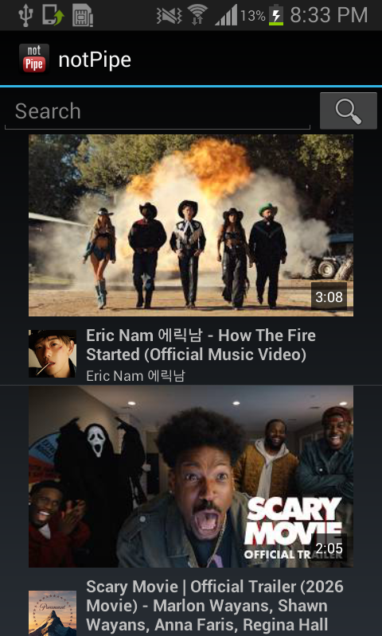
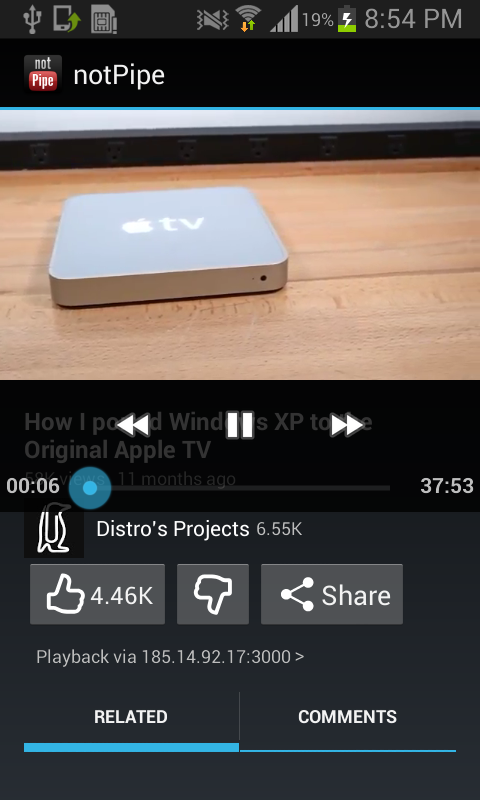
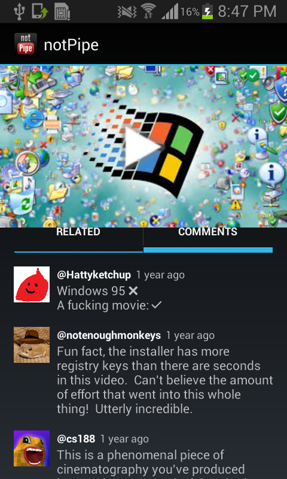
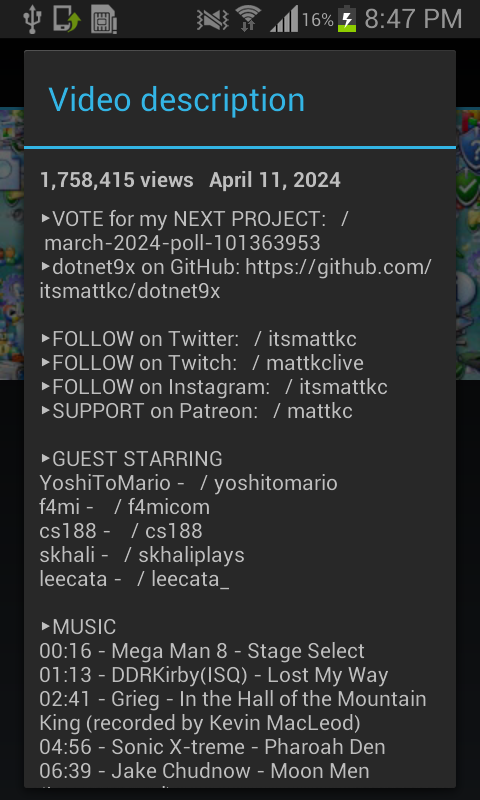
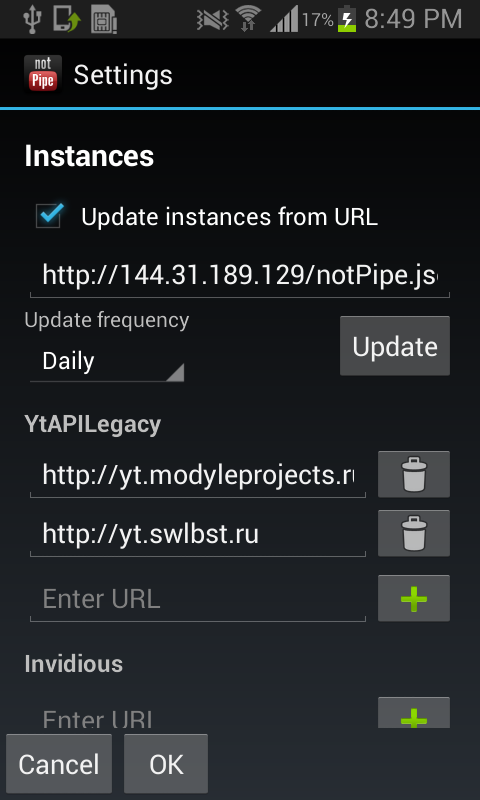
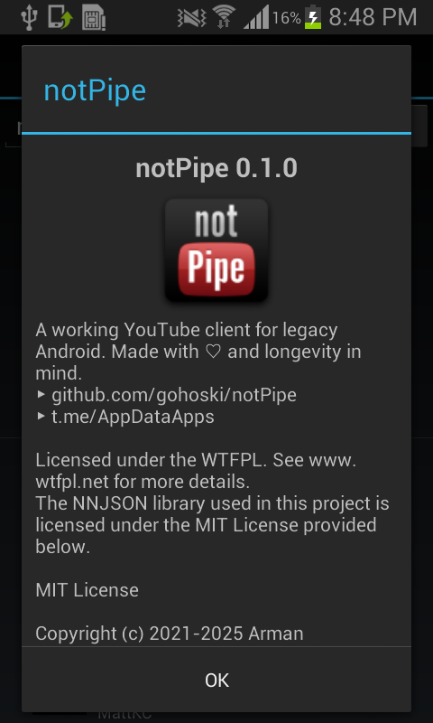

# notPipe
[English](README.md) / **русский**

Рабочий клиент YouTube для **Android 1.5+**, использующий API [Invidious](https://invidious.io), [yt2009](https://github.com/ftde0/yt2009) и [YtAPILegacy](http://yt.modyleprojects.ru). Сделан с ❤ и расчётом на долговечность. Вместо того, чтобы подключаться к одному определённому инстансу, приложение использует множество инстансов для надёжности.
* **Telegram-канал по проекту:** [@AppDataApps](https://t.me/AppDataApps)
* **[Retro Android Group](https://t.me/retroandroidgroup)** в Telegram

     

## 📥 Скачать
* [GitHub Releases](https://github.com/gohoski/notPipe/releases)
* [OldMarket](http://oldmarket.store/app.php?id=536)
* [Моя Интернет Страна](http://myintcountry.ru/index.php?board=android&action=display&num=1)
* Telegram (ссылка в начале README)
* [4PDA](https://4pda.to/forum/index.php?showtopic=1119054)
* [Appteka](https://appteka.store/apps/0d0r273445)
* [Lyano Market](http://market.lyano.ovh/details/?id=io.github.gohoski.notpipe)
* [NeonApps](http://neonapps.ru/app.php?id=456)
## Возможности
> [!NOTE]  
> Из-за различных ограничений приложение не подключается к YouTube напрямую. Вместо этого оно подключается к различным инстансам Invidious, yt2009 и YtAPILegacy. Это также обходит ограничения YouTube, поскольку весь трафик проксируется. См. «[Зачем и как это работает](#зачем-и-как-это-работает)».
* Тренды, поиск
* Видео, похожие видео, комментарии
* Воспроизведение видео
* Каналы
* Конвертация видео для устройств без поддержки H.264
* Автоматическое обновление списка инстансов с ссылки
* Планшетный интерфейс
### TODO
* Плейлисты
* Авторизация через yt2009/YtAPILegacy
* Скачивание видео
* Скачивание видео как музыку

## Фиксим проблемы на Android ≤2.3
*(видео лагают или вообще не воспроизводятся)*

Если видео не воспроизводятся, сначала попробуйте типичную диагностику:
1. **Смените инстанс.** Нажмите кнопку «Воспроизведение через … >». Некоторые инстансы могут быть временно недоступны.
2. Убедитесь, что у вас **стабильное подключение к сети.** notPipe может работать некорректно при медленном интернете.

Если это не помогло, то ваше устройство не поддерживает кодек H.264. Его поддержка сильно зависит от устройства. В notPipe есть два способа решить эту проблему:
1. **Использовать [MX Player](https://4pda.to/forum/index.php?showtopic=253883&st=10620#entry40661497)** (Android 2.1+) и переключиться на **внешний плеер** в настройках. Правда, на слабых устройствах плеер может лагать на большинстве YouTube-видео. Остаётся только пробовать.
2. **Включить конвертацию** в настройках. В этом случае видео конвертируется в кодек MPEG-4 Visual на стороне сервера, а воспроизводится через системный плеер. Требуется SD-карта. К сожалению, из-за этого перед началом воспроизведения будет задержка, но она не должна превышать 3–5 минут.

## Зачем и как это работает
Существующие способы смотреть YouTube на старых Android-устройствах страдают от двух фатальных недостатков — неудобства использования и неспособности обходить текущие защиты YT против ботов. Актуальные на сегодня способы имеют следующие проблемы:
* **Единая точка отказа.** Текущие *(и прошлые)* способы смотреть YouTube полагаются на один конкретный инстанс API (сервер). Как только такой инстанс получает заметный объём трафика, YouTube автоматически банит его IP-адрес. Кроме того, один сервер может быть сильно перегружен, из-за чего им становится невозможно пользоваться.
* **Плохая удобность использования.** Веб-обёрткам вроде S60Tube не хватает ощущения нативного приложения, плюс они требуют постоянного переключения между браузером и видеоплеером. Пропатченные APK-файлы под сервер yt2009 требуют нудного ручного изменения под каждый конкретный инстанс. К тому же, они часто страдают от сильной нагрузки при кодировании видео на стороне сервера, что приводит к бесконечной загрузке. Да и старый мобильный дизайн YouTube не всегда удобен. Всё ощущается очень костыльным.

Этот проект был создан с нуля, чтобы решить именно эти проблемы. Вместо того чтобы зависеть от единой точки отказа, этот клиент **использует несколько API и инстансов** одновременно, случайным образом выбирая новый сервер для каждого действия. Такой децентрализованный подход даёт критически важные преимущества:
1. **Обход банов.** Запросы распределяются по достаточно большому набору серверов. Поскольку ни один сервер по отдельности не генерирует огромный трафик, вероятность того, что YouTube забанит IP, радикально снижается.
2. **Производительность.** Нагрузка на пропускную способность серверов балансируется естественным путём, предотвращая жёсткие тормоза, характерные для патченных APK, привязанных к одному серверу.
3. **Оно просто работает.** Вы получаете нативный интерфейс Android без необходимости самостоятельно патчить APK или настраивать личные серверы.
4. **Никакой единой точки отказа.** Поскольку именно так умерли предыдущие клиенты YouTube, здесь всё децентрализовано и открыто для вклада любого желающего.
5. **Автоматическое обновление инстансов.** Список инстансов обновляется автоматически и по умолчанию загружается с http://144.31.189.129/notPipe.json, что требует от пользователя минимум действий.

## Как помочь проекту
Спасибо, что хотите внести вклад! Любая помощь важна — от отчёта о баге до перевода одной фразы.
### Сообщить о баге
**Вам во вкладку «[Issues](https://github.com/gohoski/numAi/issues)» на GitHub!** Не забудьте указать, на какой версии Android и архитектуре (ARMv5/v6/v7/др.) вы столкнулись с проблемой.
### Помочь с переводом
Проект говорит на вашем языке? А если нет — помогите ему заговорить! Переводы делают приложение доступным и удобным для всех людей. Переведите файл [strings.xml](https://github.com/gohoski/notPipe/blob/main/app/src/main/res/values-ru/strings.xml), учитывая правила [Android string resources](https://developer.android.com/guide/topics/resources/string-resource), и предоставьте его. Вы также можете перевести README.md.

## Сборка
Проект разрабатывается в следующей среде:
* Android Studio 2.3.2 [`Скачать`](https://developer.android.com/studio/archive)
  * Android Studio 1.0–3.1.2 могут поддерживать Android <2.2, но для разработки рекомендуется именно 2.3.2, так как она достаточно старая, но при этом всё ещё поддерживается.
  * Последние версии AS по-прежнему поддерживают Android 2.2 и выше (хотя и заточены под 4.1+). Вы можете использовать их, если поддержка совсем старых версий Android для вас не в приоритете.
* Android SDK любой версии *(рекомендуется 25)*
  * Использовать старый SDK для разработки ретро-приложений не обязательно.
* Эмулятор Android 1.5/1.6 из SDK [`Скачать`](https://developer.android.com/sdk/older_releases#release-1.6-r1)

При внесении вклада в проект рекомендуется использовать AS, однако вы можете использовать любую другую IDE, при условии, что проект останется работоспособным и в AS.

## Благодарности
* [How-to-develop-and-backport-for-Android-2.1-in-2020](https://github.com/Mik-el/How-to-develop-and-backport-for-Android-2.1-in-2020) — шаблон проекта от Микеле
* [NNJSON](https://github.com/shinovon/NNJSON) — библиотека от nnproject
* **Отдельное спасибо всем контрибьюторам [Invidious](https://github.com/iv-org/invidious/graphs/contributors), [yt2009](https://github.com/ftde0/yt2009/graphs/contributors) и [YtAPILegacy](https://github.com/ZendoMusic/yt-api-legacy/graphs/contributors) за создание этих потрясающих API**
### Предыдущие клиенты YouTube
Хотя они не использовались ни как источник вдохновения, ни как кодовая база, эти приложения заслуживают упоминания, поскольку именно они навели на идею создания этого проекта.
* [Mini YouTube от monobogdan](https://github.com/monobogdan/selfeco) — клиент для Android 2.0+, использующий захардкоженный инстанс Invidious с проксированием запросов через российский сервер monobogdan'а. Сейчас прокси-сервер мёртв, а учитывая, что здесь присутствует «единая точка отказа», компилировать проект с новым инстансом, даже убрав прокси, не имеет смысла.
* [ReOldTube от YMP Yuri](https://github.com/YMP-CO/ReOld-Tube) — клиент для Android 3.0+, использующий Invidious. Несмотря на то, что в настройках его можно сконфигурировать для работы и сегодня, в нём полно багов *(да и написан он «на вайбах» / vibecoded)*.
## Лицензия
Проект **notPipe** распространяется под лицензией Do What The Fuck You Want To Public License, версия 2. Подробности см. в файле [LICENSE](LICENSE). *При желании можете указать меня в README своего проекта.*  

ОДНАКО библиотека NNJSON распространяется под лицензией MIT. Подробности см. в файле [LICENSE-NNJSON](LICENSE-NNJSON).